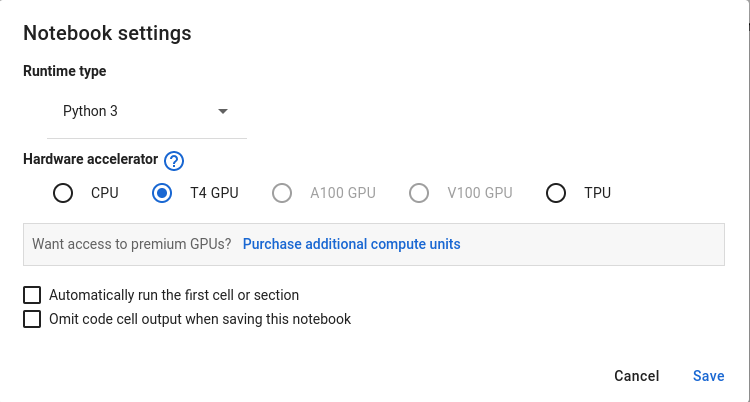
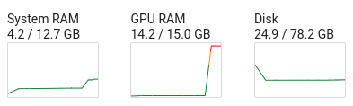
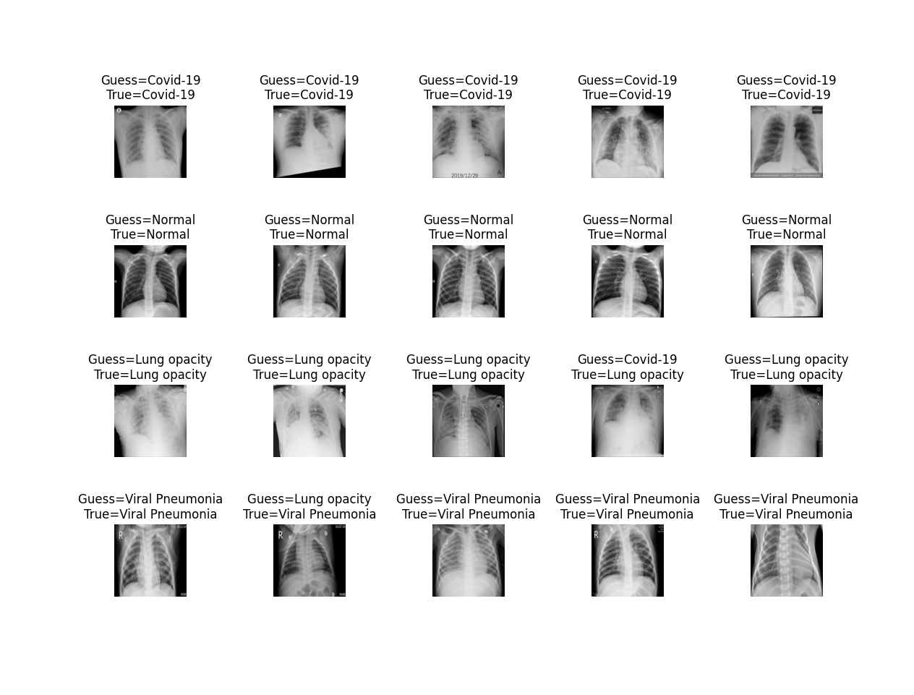

# 🧠 IA

Esse módulo é destinado para o treinamento do modelo de IA para classificação de Raio X

## 🛠️ Dependências

É necessário que sejam instaladas as seguintes dependências

- opencv
- numpy
- tensorflow
- matplotlib

## 🩻 Treinamento da IA

O treinamento da IA para geração do modelo pode ser feita de duas maneiras:

- Google Colab
- Localmente

Por questões de praticidade (e até performance) é recomendado que seja usado o Google Colab para fazer o treinamento

### 🌐 Google Colab

Para executar o código via Google Colab é necessário enviar o código `train.py` e todas as imagens do diretório `train`

As imagens podem ser enviadas gerando um arquivo `zip` com todas as imagens e posteriormente fazer um `unzip` como no seguinte exemplo

```sh
!unzip train.zip
```

É importante ativar o uso de GPU nas configurações do Colab.

<p align="center">
    
</p>

Em sequência basta executar o código `train.py`. É possível verificar que o processo de treinamento consome bastante recurso de `VRAM`


<p align="center">
    
</p>


O treinamento demora cerca de 20 minutos e é gerado um arquivo do modelo `model.h5` e `model.json`, que devem ser baixados e colocados dentro do diretório `model`.

### 💻 Localmente

O treinamento do modelo localmente costuma demorar muito mais tempo caso o computador não possua uma GPU dedicada

Caso possua uma GPU dedicada é necessário seguir o passo a passo de ativação de GPU no tensorflow que pode ser encontrado [aqui](https://www.tensorflow.org/install/gpu?hl=pt-br)

Com as configurações feitas basta executar o programa `train.py`

```sh
python3 train.py
```

O tempo de treinamento pode variar de acordo com os recursos computacionais da máquina.

Os modelos gerados são armazenados no diretório `model` e não é necessário fazer nenhuma mudança do diretório dos arquivos.

## 🧪 Teste da IA

Com o modelo treinado é possível fazer o teste da IA utilizando o programa `test.py`

Nele são selecionadas imagens alteatórias do diretório de testes e é comparado o resultado esperado com o classificado pela IA

O programa que realiza o teste não requer muita capacidade computacional, assim não é necessário que seja executado no Google Colab.

Para executar os testes basta rodar o comando

```sh
python3 test.py
```

**Resultados**

É retornado algumas métricas referentes a assertividade das classificações feitas pela IA, respeitando a seguinte legenda:

- 0: COVID-19
- 1: Normal
- 2: Opacidade Pulmonar
- 3: Pneumonia Viral
  
```
Test Accuracy : 0.95703125

              precision    recall  f1-score   support

           0       0.94      0.95      0.95        64
           1       0.96      1.00      0.98        64
           2       0.95      0.92      0.94        64
           3       0.98      0.95      0.97        64

   micro avg       0.96      0.96      0.96       256
   macro avg       0.96      0.96      0.96       256
weighted avg       0.96      0.96      0.96       256
```

Além disso, é retornado visualmente algumas imagens que foram classificadas, tendo o resultado esperado e o resultado classificado pela IA.

<p align="center">
    
</p>